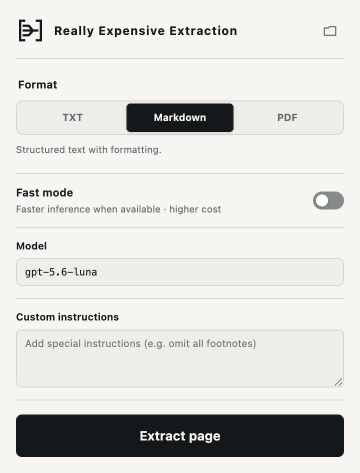

**Text extraction that 'just works':** feed any webpage, HTML file, PDF, image, or image gallery to GPT-5.6 Luna and ask it to extract its text. Sure, it's **'Really Expensive Extraction'**, but hey, it works every time! REE is a Chromium extension and a CLI that drives the [OpenAI Codex CLI](https://github.com/openai/codex) using your ChatGPT auth, so it's easy to use and you're not footing the bill!

## Install

You'll need:

- [Node.js](https://nodejs.org/) 22.13 or newer
- the [OpenAI Codex CLI](https://github.com/openai/codex), signed in with ChatGPT (`codex login`)
- a Chromium browser — Edge, Chrome, Brave, etc. — easiest to use through the extension

Install from the source:

```sh
git clone https://github.com/maximilianromer/ree.git
cd ree
npm install
npm run build
npm link
ree doctor
```

`ree doctor` checks all of the above — Node, Codex and its login, your browser, Fast-mode availability, the extension bridge — and tells you exactly what's missing. If your browser lives somewhere unusual, point `REE_CHROMIUM_PATH` at the executable.

## Usage

```sh
ree https://example.com/article               # Markdown to stdout
ree paper.pdf > paper.md                      # PDFs work the same way
ree article.html --format txt -o article.txt  # plain text, built for TTS
ree page.jpg --format txt -o page.txt          # text from one image
ree book-photos --format txt -o book.txt       # a directory of photographed pages
ree page-1.jpg page-2.jpg -o pages.md          # explicit gallery order
ree https://example.com/article --format pdf  # reading-edition PDF with images
cat page.html | ree -                         # HTML over stdin
```

Image directories include JPEG, PNG, WebP, and GIF files directly inside them, ordered naturally by filename (`page-2` before `page-10`). Passing multiple image paths preserves the argument order instead. This makes photographed books and other multi-image documents work as one source.

The three formats:

- **Markdown** (default) — a faithful text recreation of the page: heading hierarchy, links, lists, blockquotes, tables, code, footnotes, and equations, with no images. Best for LLM context.
- **TXT** — plain article text with no markup at all, safe to pipe straight into a TTS engine.
- **PDF** — a full reading edition: the Markdown plus the source's meaningful figures placed back in reading order, printed as a searchable, linked, paginated document. Unless `--no-images` is used, it will insert the images used in the source.

TXT and Markdown go to stdout unless you pass `-o`. PDF always writes a file and picks a sensible name when you don't.

### Custom instructions

Steer a single generation without touching any config:

```sh
ree paper.pdf --custom-instructions "Keep the appendix and all footnotes" > paper.md
```

When instructions conflict with REE's defaults, your instructions win.

### Model and speed

```sh
ree article.html --model gpt-5.7 --fast
```

`gpt-5.6-luna` is the default model. `--model` accepts any slug your Codex account can use and remembers a valid choice for later runs; there's no allowlist, and if a model is unavailable REE stops instead of silently substituting another. `--fast` requests Codex Fast inference — recommended, but quicker and higher credit cost. Progress goes to stderr; `--quiet` silences it, `--verbose` shows every stage.

## The extension

The CLI fetches URLs like a logged-out browser, but if you want to do it without writing commands or fetch something behind a login (like a paywalled article), the browser extension is the way to go.



1. Build the project (`npm run build`), if you haven't already.
2. Open `chrome://extensions`, enable Developer mode, click **Load unpacked**, and select `dist/extension`.
3. Run `ree setup-extension` to register the local bridge.
4. Reload the extension, open an article, and click **Extract page**.

The popup has the same controls as the CLI (format, images, Fast mode, model, custom instructions) and streams the model's reasoning and output live while it works. Finished files land in `Documents/REE Extractions`, one click away via the folder button in the popup header.

You can also run multiple extractions at the same time. A status dot on the extension icon will show you how many are running, and flash green when they're done.

## Agent skill

REE includes a project-local [agent skill](.agents/skills/ree/SKILL.md) for coding agents that support skills. It teaches an agent how to run the CLI for webpages, local documents, and image galleries, choose the requested output format, and verify the result.

## Acknowledgements

- [OpenAI Codex](https://github.com/openai/codex) — the local agent runtime REE drives for every extraction
  - This project was built almost entirely with GPT-5.6 Sol
- [pdf.js](https://mozilla.github.io/pdf.js/) — Mozilla's PDF engine, used to read pages and figures
- [Playwright](https://playwright.dev/) — controls headless Chromium for capture and PDF printing
- [markdown-it](https://github.com/markdown-it/markdown-it) — renders the model's Markdown into the PDF edition
